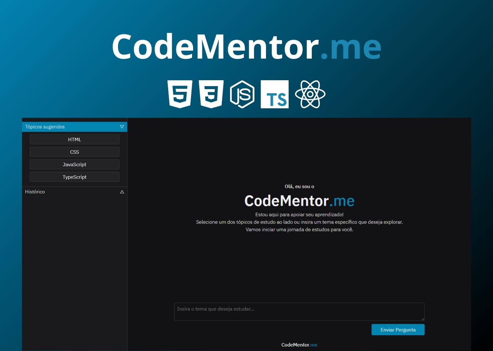

<h1 align="center"> CodeMentor.me </h1>

CodeMentor.me um site conectado a IA que te ajuda a estudar programação!

  <a href="#-tecnologias">Tecnologias</a>&nbsp;&nbsp;&nbsp;|&nbsp;&nbsp;&nbsp;
  <a href="#-projeto">Projeto</a>&nbsp;&nbsp;&nbsp;|&nbsp;&nbsp;&nbsp;

 

  

## 🚀 Tecnologias

Esse projeto foi desenvolvido com as seguintes tecnologias:

- HTML e CSS
- JavaScript
- TypeScript
- Git e Github
- React
- Node js

## 💻 Projeto

Apresento o CodeMentor.me, seu professor artificial dedicado a facilitar o aprendizado de linguagens de programação. Com ele, você explora conceitos, pratica códigos e esclarece dúvidas de forma rápida e interativa, diretamente no seu dispositivo. Ideal para impulsionar seus estudos, seja você iniciante ou avançado, tornando o processo mais dinâmico e eficiente.

---

Feito por Riquelme Guedes